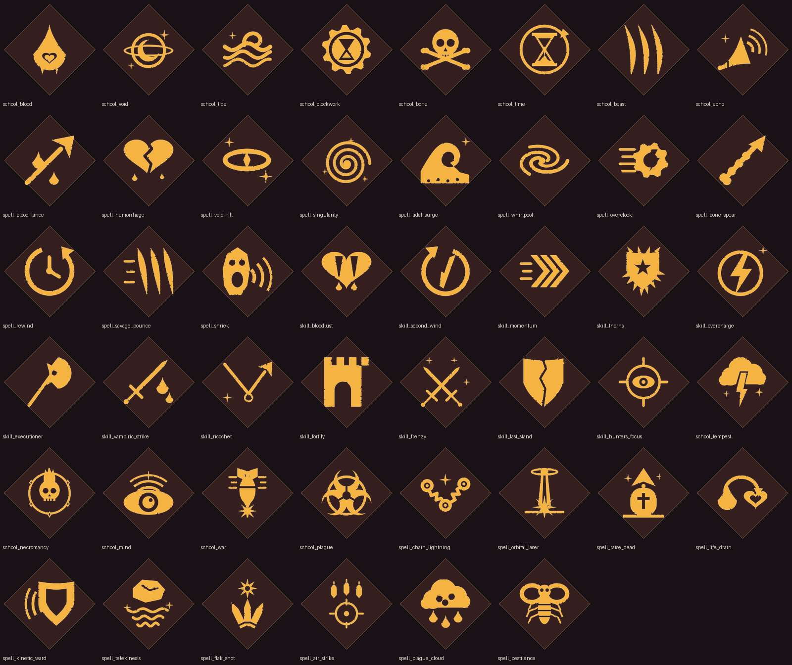

.. _howto-content:

*************************************
New skills, magic schools and spells
*************************************

The API can add content that becomes part of the game: a skill offered on the upgrade screen next to
the game's own, a magic school that casters pick between fights, and the spells that school teaches,
drawn on the wand's rune grid and cast like any other. The game levels, syncs and shows them itself.

Everything here is registered once, in your plugin's ``Load()``, and works in solo games and on
modded servers. See :ref:`content-rules` before you ship.

The `Arcana <https://github.com/IlumCI/ironstrike-api/tree/main/examples/Arcana>`_ example mod
adds five schools and ten spells (chain lightning, an orbital laser, necromancy, telekinesis, air
strikes, plagues...) in about 400 lines. Read it next to this page.

A new skill
===========

:cs:meth:`ModContent.Skill <IronstrikeApi.ModContent.Skill>` registers a skill. Every field and hook is
optional::

   using IronstrikeApi;
   using IronstrikeApi.Content;

   ModContent.Skill("mymod.bloodlust", s =>
   {
       s.Name = "Bloodlust";
       s.Icon = Icons.Library("skill_bloodlust");
       s.Category = SkillCategory.Valor;               // the upgrade-screen category it is offered in
       s.Class = SkillClass.Fighter;                   // null offers it to every class
       s.Describe = level => $"Deal {10 * level}% more damage.";
       s.OutgoingDamageBonus = (ctx, hit) => 0.10f * ctx.Level;
   });

The card shows the name with the game's numeral ("Bloodlust II"), your text and your icon. When the
player takes it, the game copies the skill onto their fighter and starts calling its hooks.

Bonuses
-------

The game asks every skill a fighter has for its share of a stat and **adds the answers up**. So a
bonus hook returns a fraction (``0.2f`` is +20%), ``0`` for nothing, and never needs to know about
other skills. :cs:type:`~IronstrikeApi.Content.CustomSkill` lists them: damage dealt and taken (and
their armour variants), move speed, jumps, dash, reload, arrow gravity, ironstrike range, guard
damage, and the caster stats (mana, spell cooldown, damage and duration per spell category).

Events
------

``OnAdded``, ``OnRemoved``, ``OnTick``, ``OnEncounterStart``, ``OnOutgoingHit``, ``OnIncomingHit``,
``OnFighterDeath``, ``OnDash``, ``OnMeleeBlock``, ``OnProjectileBlock`` and ``OnSpellCast``. Each
says in its documentation which machine it runs on. ``ctx.State`` is yours to keep per-fighter state
in.

Offers
------

:cs:prop:`~IronstrikeApi.Content.CustomSkill.OfferWeight` sets how often the skill turns up compared
with one of the game's (1 = as often; 0 = never, give it with
:cs:meth:`~IronstrikeApi.ModContent.GiveSkill`). The number of cards never changes: custom skills
compete with the game's for the same slots. A skill is not offered past its
:cs:prop:`~IronstrikeApi.Content.CustomSkill.MaxLevel`, to another class, or next to a skill in its
:cs:prop:`~IronstrikeApi.Content.CustomSkill.ExclusiveWith` list.

A magic school and its spells
=============================

In IRONSTRIKE a caster learns spells from **schools** (Ars Ignis teaches Fireball and Balefire). A
custom school is the same: an upgrade that teaches two spells. Register the spells first, then the
school::

   ModContent.Spell("mymod.chain_lightning", s =>
   {
       s.Name = "Chain Lightning";
       s.Icon = Icons.Library("spell_chain_lightning");
       s.Targeting = SpellTargetingType.SingleEnemy;   // aimed at one enemy
       s.LooksLike = SpellType.LightningBolt;           // its indicators and preview
       s.Cooldown = new[] { 9f };                       // per level; the last value repeats
       s.ManaCost = new[] { 15f };
       s.Range = new[] { 50f };
       s.Amount = (ctx, target) => 40 + 8 * (ctx.Level - 1);    // worked out by the caster
       s.OnCast = (ctx, cast) =>                                 // runs on every machine
       {
           SpellFx.Bolt(cast.Origin, Body.Center(cast.Target), Color.cyan);
           cast.Damage(cast.Target, cast.Amount);
       };
   });
   ModContent.Spell("mymod.orbital_laser", s => { /* ... */ });

   ModContent.School("mymod.tempest", s =>
   {
       s.Name = "Ars Tempestas";
       s.Icon = Icons.Library("school_tempest");
       s.Category = SkillCategory.Evocation;            // or Enchantment
       s.Runes = SkillType.StormMagic;                   // whose rune shapes it borrows
       s.Spells.Add("mymod.chain_lightning");            // drawn like Static Field (3 strokes)
       s.Spells.Add("mymod.orbital_laser");              // drawn like Lightning Bolt (4 strokes)
   });

Runes
-----

The rune grid has one branch of fixed shapes per game school. A custom school copies the branch of
the school named in :cs:prop:`~IronstrikeApi.Content.CustomSchool.Runes`: its first spell is drawn
like that school's first spell, its second like its second. So the shapes never clash, a player
cannot hold both schools: the upgrade screen offers one or the other, and two mods cannot borrow the
same school's runes (registration fails with a clear message).

.. list-table:: Rune branches (first spell / second spell)
   :header-rows: 1

   * - ``Runes``
     - School
     - Shapes of
   * - ``EarthMagic``
     - Ars Terra
     - Cobbleshot / Cometfall
   * - ``StormMagic``
     - Ars Fulmen
     - Static Field / Lightning Bolt
   * - ``FireMagic``
     - Ars Ignis
     - Fireball / Balefire
   * - ``IceMagic``
     - Ars Glacies
     - Icicles / Frost Nova
   * - ``LightMagic``
     - Ars Lux
     - Moonbeam / Solar Flare
   * - ``AlchemicalMagic``
     - Ars Alchemia
     - Acid Spray / Poison Sting
   * - ``ForestMagic``
     - Forest Magic
     - Razor Leaf / Thorn Growth
   * - ``StarMagic``
     - Star Magic
     - Starfire / Supernova
   * - ``ShadowMagic``
     - Shadow Magic
     - Invisibility / Vulnerability
   * - ``DivineMagic``
     - Divine Magic
     - Levitate / Spirit Link
   * - ``LuckMagic``
     - Luck Magic
     - Fortune / Jinx
   * - ``IronMagic``
     - Iron Magic
     - Ironskin / Rust
   * - ``MirrorMagic``
     - Mirror Magic
     - Feedback / Transpose
   * - ``WindMagic``
     - Wind Magic
     - Missile Shield / Haste
   * - ``LifeMagic``
     - Life Magic
     - Heal / Transfuse
   * - ``CrystalMagic``
     - Crystal Magic
     - Clarity / Crystallize

Aiming
------

:cs:prop:`~IronstrikeApi.Content.CustomSpell.Targeting` is the game's own:

``Ray``
   Along the wand. ``cast.Origin`` and ``cast.Direction``.
``GroundCircle``
   A point on the ground. ``cast.Point``.
``Self``
   No aiming; ``cast.Target`` is the caster.
``SingleEnemy``, ``SingleAlly``, ``SingleNonSelf``
   One fighter, picked by pointing. ``cast.Target``, and ``cast.Amount`` from your
   :cs:prop:`~IronstrikeApi.Content.CustomSpell.Amount` hook.

:cs:prop:`~IronstrikeApi.Content.CustomSpell.LooksLike` names the game spell whose aiming
indicators, casting preview and projectile or area effect yours borrows. Pick one with the same
targeting.

Doing things
------------

:cs:prop:`~IronstrikeApi.Content.CustomSpell.OnCast` runs **on every machine at the same moment**,
the way the game's own spells work. :cs:type:`~IronstrikeApi.Content.SpellCast` gives you tools that
know this:

.. list-table::
   :header-rows: 1
   :widths: 35 65

   * - Tool
     - What it does
   * - ``cast.Damage(f, amount)``
     - Hits a fighter through the game's spell-hit message: armour, skills, damage numbers and kills
       work. Sent once, by the caster's machine.
   * - ``cast.Heal(f, amount)``
     - Heals a player (sent once) or a bot (by the host).
   * - ``cast.Status(f, type, seconds, amount)``
     - A status effect: ``Poison`` and ``Acid`` (``amount`` is damage per second), ``Slowed``,
       ``Stunned``, ``Levitation``, ``MissileShield``, ``Barrier``, ``Haste``...
   * - ``cast.EnemiesNear(p, r)``, ``cast.AlliesNear(p, r)``
     - Living fighters within a radius, nearest first, in the same order on every machine.
   * - ``cast.FallenAlliesNear(p, r)``, ``cast.Revive(f)``
     - Fallen players, and bringing them back.
   * - ``cast.After(seconds, c => ...)``
     - Runs something later, everywhere: salvos, delayed slams, damage over time.
   * - ``cast.SpawnArea(p, dir, damage)``
     - The area effect of ``LooksLike`` (Cometfall's impact, Acid Spray's cloud, Balefire's flames);
       fighters it touches go to :cs:prop:`~IronstrikeApi.Content.CustomSpell.OnAreaHit` (by default
       they take ``damage``).
   * - ``cast.SpawnProjectile(p, dir)``
     - The projectile of ``LooksLike`` (Fireball, Cobbleshot, Icicles, Starfire).

:cs:type:`~IronstrikeApi.Content.SpellFx` draws simple effects of your own: a jagged
``Bolt``, a straight ``Beam``, a ``Ring`` on the ground and a ``Flash`` of coloured light.

Use :cs:type:`~IronstrikeApi.Gameplay.Body` for positions: a fighter's own ``transform`` is not
where its body is.

Anything random must come out the same on every machine. Seed it from the cast, as Arcana's Air
Strike does: ``new System.Random((int)(cast.Point.x * 31 + cast.Point.z * 17))``.

Icons
=====

:cs:type:`~IronstrikeApi.Content.Icons` turns a picture into a card icon:

``Icons.Library(name)``
   One of the API's own, drawn in the game's style (see :ref:`howto-content-icons`).
``Icons.FromFile("icons/berserk.png")``
   A PNG next to your DLL.
``Icons.FromResource(typeof(Plugin).Assembly, "MyMod.berserk.png")``
   A PNG embedded in your DLL.
``Icons.FromSkill(SkillType.Berserk)``, ``Icons.FromSpell(SpellType.Fireball)``
   One of the game's.

Draw white on transparent; the game tints it. Any size and margin works: the API centres the drawing
on a square and gives it the same margin as the game's icons.

.. _howto-content-icons:

The icon library
----------------

``school_blood``, ``school_void``, ``school_tide``, ``school_clockwork``, ``school_bone``,
``school_time``, ``school_beast``, ``school_echo``, ``school_tempest``, ``school_necromancy``,
``school_mind``, ``school_war``, ``school_plague``; ``spell_blood_lance``, ``spell_hemorrhage``,
``spell_void_rift``, ``spell_singularity``, ``spell_tidal_surge``, ``spell_whirlpool``,
``spell_overclock``, ``spell_bone_spear``, ``spell_rewind``, ``spell_savage_pounce``,
``spell_shriek``, ``spell_chain_lightning``, ``spell_orbital_laser``, ``spell_raise_dead``,
``spell_life_drain``, ``spell_kinetic_ward``, ``spell_telekinesis``, ``spell_flak_shot``,
``spell_air_strike``, ``spell_plague_cloud``, ``spell_pestilence``; ``skill_bloodlust``,
``skill_second_wind``, ``skill_momentum``, ``skill_thorns``, ``skill_overcharge``,
``skill_executioner``, ``skill_vampiric_strike``, ``skill_ricochet``, ``skill_fortify``,
``skill_frenzy``, ``skill_last_stand``, ``skill_hunters_focus``.

They are drawn by a script in the repository (``art/icons/make_icons.py``), so the set can grow in
the same style.

.. _content-rules:

Rules
=====

* **Register in** ``Load()``, **unconditionally.** Ids are handed out from the sorted list of every
  mod's keys when the game first reads its skill list. Registering later throws.
* **Everyone needs the same content.** Players' mods compare a fingerprint of all registered
  content when they greet each other. If it differs, custom content switches off for that session
  (the log says so), so nobody sees a skill or spell another player's game cannot show.
* **Solo and modded servers only.** In Private Matches a player without your mod could not load the
  content, so it is off there; in public games the API is locked out anyway
  (:ref:`howto-safety`). :cs:prop:`~IronstrikeApi.ModContent.Active` says whether it is on.
* **Keys** are lower-case, with your mod's prefix: ``mymod.bloodlust``.
* A hook that throws is logged with your mod's name. After five failures the skill or spell switches
  off for the rest of the game; the game itself carries on.
* **Room.** Custom skills and schools share the free ids below 256 in the game's skill list (about 140);
  spells have about 220.

How it works
============

For the curious, and for the next game update:

* The API registers one ``Skill`` subclass and one ``Spell`` subclass with Il2CppInterop and files a
  template of each custom skill, school and spell in the game's own dictionaries
  (``SkillDatabase.GetSkillDict``, ``SpellDatabase.GetSpellDict``) under its id. From there the game
  copies them onto fighters as it does its own.
* A school is a copy of the game school whose runes it borrows (an ``UnlockSpellsSkill``) with its
  two spells swapped for the API's. The rune grid's branch for that school is copied the same way.
* The game asks a skill for its share of a stat through ~40 virtual methods; the API's subclass
  forwards each to your hooks, guarded.
* Injected classes are marked for the garbage collector to scan: Il2CppInterop leaves that bit clear,
  and without it the game crashed on the first copy after a level load (see :ref:`howto-il2cpp`).
